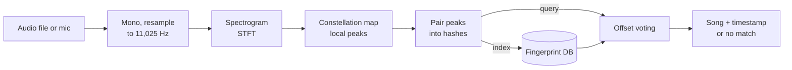

# How the algorithm works

This is an implementation of the approach in Avery Wang's 2003 paper
[*An Industrial-Strength Audio Search Algorithm*](https://www.ee.columbia.edu/~dpwe/papers/Wang03-shazam.pdf),
the method behind the original Shazam service. This page walks through each
stage, the parameters this project uses, and why.



Songs being indexed and clips being identified go through **exactly the same
pipeline**. Only the last step differs: indexing stores the hashes, matching
looks them up.

## 1. Decode and resample (`src/audio.rs`)

Audio is decoded with [symphonia](https://github.com/pdeljanov/Symphonia)
(MP3, WAV, FLAC, OGG, AAC/M4A), mixed down to mono, and resampled to
**11,025 Hz**.

- **Why so low?** The features that identify a song (melody, harmonics,
  drums) are mostly below ~5 kHz. A quarter of CD sample rate means a
  quarter of the work.
- **Why resample at all?** The MacBook microphone records at 48 kHz, while
  music files are usually 44.1 kHz. Frequencies only map to the same FFT bins if
  every input ends up at one common rate.

The resampler is a windowed-sinc interpolator: a Hann-windowed sinc kernel with
10 zero-crossings each side, tabulated for speed. When downsampling, the same
kernel is a low-pass filter at 90% of the new Nyquist frequency, so
content that can't be represented at 11 kHz is removed rather than *aliased*
(folded down) into false low frequencies. A unit test checks this: an 8 kHz
tone must disappear, not reappear at 3 kHz.

## 2. Spectrogram (`Fingerprinter::spectrogram`)

A short-time Fourier transform:

| Parameter | Value | Meaning |
|---|---|---|
| FFT size | 1024 samples | 93 ms window, 10.8 Hz per frequency bin |
| Hop | 256 samples | a new frame every 23 ms (75% overlap) |
| Window | Hann | reduces spectral leakage |

Each frame's magnitudes are converted to decibels. The result is a 2D grid of
loudness by time and frequency.

## 3. Constellation map (`find_peaks`)

Here a dense spectrogram becomes a sparse set of **peaks**: points that are
louder than everything around them. Wang's insight is that peaks are robust.
Noise, a bad speaker or a cheap microphone change *how loud* things are, but the
loudest points in the music tend to stay the loudest points.

A point is kept as a peak if:

1. it is the maximum within **±5 frequency bins and ±3 frames** (a 2D max
   filter, computed separably: first across frequency, then across time);
2. it is within **60 dB** of the loudest point in the audio, and above an
   absolute floor, so digital silence yields nothing;
3. it lies between **~170 Hz and ~5.5 kHz**. Laptop mics barely capture
   bass, so peaks below that would appear in the indexed song but not in a mic
   recording.

The result is then thinned to the **30 loudest peaks per second**. Without a
cap, noisy or dense passages would produce huge numbers of weak peaks.

## 4. Combinatorial hashing (`hashes`)

A single peak (a frequency at a time) is not distinctive: thousands of songs
have a loud 440 Hz note at some point. A **pair** of peaks is much more
specific. Each peak acts as an **anchor** and is paired with the next
**20 peaks** that fall 1 to 90 frames (~2 s) after it, its *target zone*.

Each pair becomes a 32-bit hash:

```
 31          23 22          14 13                0
┌──────────────┬──────────────┬──────────────────┐
│ anchor bin   │ target bin   │ Δ frames         │
│ (9 bits)     │ (9 bits)     │ (14 bits)        │
└──────────────┴──────────────┴──────────────────┘
```

The hash contains **no absolute time**, only the gap between the two peaks.
That's what lets a clip from the middle of a song produce the same hashes as
the full song. Each hash is stored with its anchor's absolute frame number so
matching can recover the alignment.

A 3-minute song produces around 100,000 hashes; the 54-song test library about
5.9 million.

## 5. The database (`src/db.rs`)

A flat array of `(hash, song id, frame)` entries sorted by hash, saved with
[bincode](https://github.com/bincode-org/bincode). A lookup is two binary
searches. For a demo library this is simpler and more compact than a hash map
or SQLite: 54 songs make a ~68 MB file that loads in a fraction of a second.

The file stores a `FINGERPRINT_VERSION`. Changing any fingerprint parameter
bumps it, so a stale database is rejected with a clear message rather than
silently failing to match.

## 6. Matching by offset voting (`src/matcher.rs`)

For every hash in the query clip, look up all songs containing that hash and
compute

```
offset = (frame in song) − (frame in clip)
```

and add a vote to `(song, offset)`.

- For the **correct song**, the matching hashes all come from the same
  alignment, so they pile up on **one offset**: the point in the song where
  the clip starts.
- **Wrong songs** share hashes with the clip too (common intervals, common
  notes), but at random alignments, so their votes scatter thinly across many
  offsets.

A song's score is its tallest offset bin. Neighbouring bins (±1 frame) are
included, because a peak can land one frame early or late depending on how the
clip's frames happen to line up with the song's.

This is why the algorithm tolerates heavy noise. It doesn't need most hashes to
survive, only enough of them to agree with each other.

### When is it a match?

The best song must have:

- **≥ 80 aligned hashes**, an absolute floor above the chance scores
  observed for 5–10 s clips of unknown songs (max ~60); and
- **≥ 2.5× the runner-up's score**. Chance alignments grow with clip length,
  but they grow for *every* song at once, so they never stand out from the
  pack. A real match does.

See [evaluation.md](evaluation.md) for how these thresholds were chosen.

## 7. Live listening (`src/mic.rs`, `listen` command)

[cpal](https://github.com/RustAudio/cpal) opens the default input device
(CoreAudio on macOS) and streams samples into a shared buffer. Every second
the `listen` command takes everything recorded so far, runs the full
pipeline on it, and stops as soon as the match is confident. Most songs are
identified in 2–4 seconds. Re-processing the whole buffer each time is wasteful
in principle, but 20 seconds of audio takes only milliseconds.

## Known limitations

- **No tempo or pitch-shift invariance.** Hashes encode exact frequency
  bins and time gaps, so a sped-up or pitch-shifted version won't match the
  original. That's a design property of this algorithm, and also why it
  can tell a song's "faster" and "slower" versions apart.
- **Repeated sections are ambiguous.** If a chorus or loop repeats
  exactly, a clip of it matches the right song, but the reported timestamp may be
  that of another repetition.
- **Scale.** The database lives entirely in memory and every lookup is a
  binary search. That's fine for thousands of songs, but a production system
  would shard the index and filter by time-coherence before voting.
